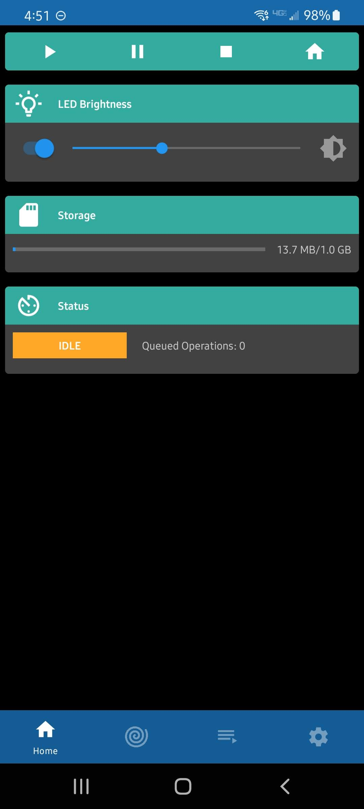
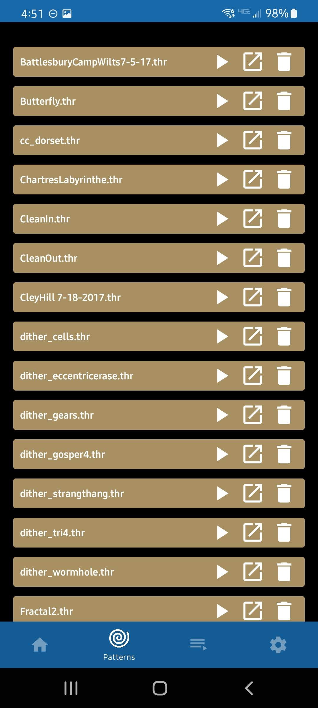
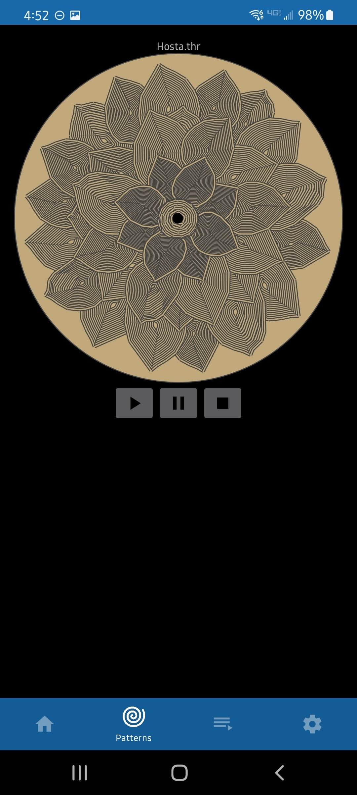
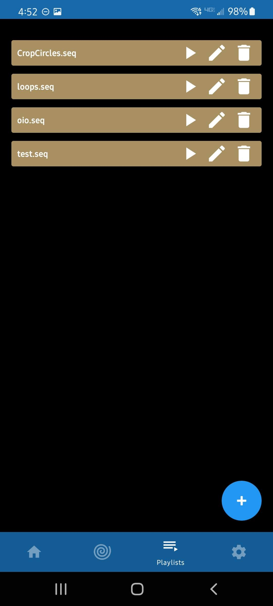
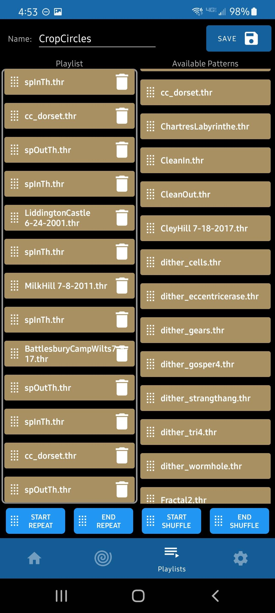

# SandBot-Android

Android app interface to my [DIY Kinetic Sand Table](http://alwaystinkering.com/2020/01/14/diy-kinetic-sand-art-table/)

This app is an interface to the sand table firmware create by Rob Dodson. It will not function with any other projects.  See https://github.com/robdobsn/RBotFirmware

Implemented using latest (at time of development) android architecture practices

## Basic Robot Functions
* Home
* Start
* Stop
* Pause
* LED on/off and brightness (if hardware is implemented)
* Storage status
* Motion Control Status

## Pattern List
See all the patterns (.thr and .param) that reside on the robot's storage. Play the files directly from the list, preview them or delete them from the robot

## Pattern Preview
Preview what a pattern will look like on the sandtable. Watch as the pattern is generated to preview how the pattern will be drawn in the sand

## Playlists
Start, Edit and Delete playlists

## Playlist Editor
Create playlists with full drag and drop capability from available patterns on the robot's storage. Drag and drop repeat and shuffle indicators as well

